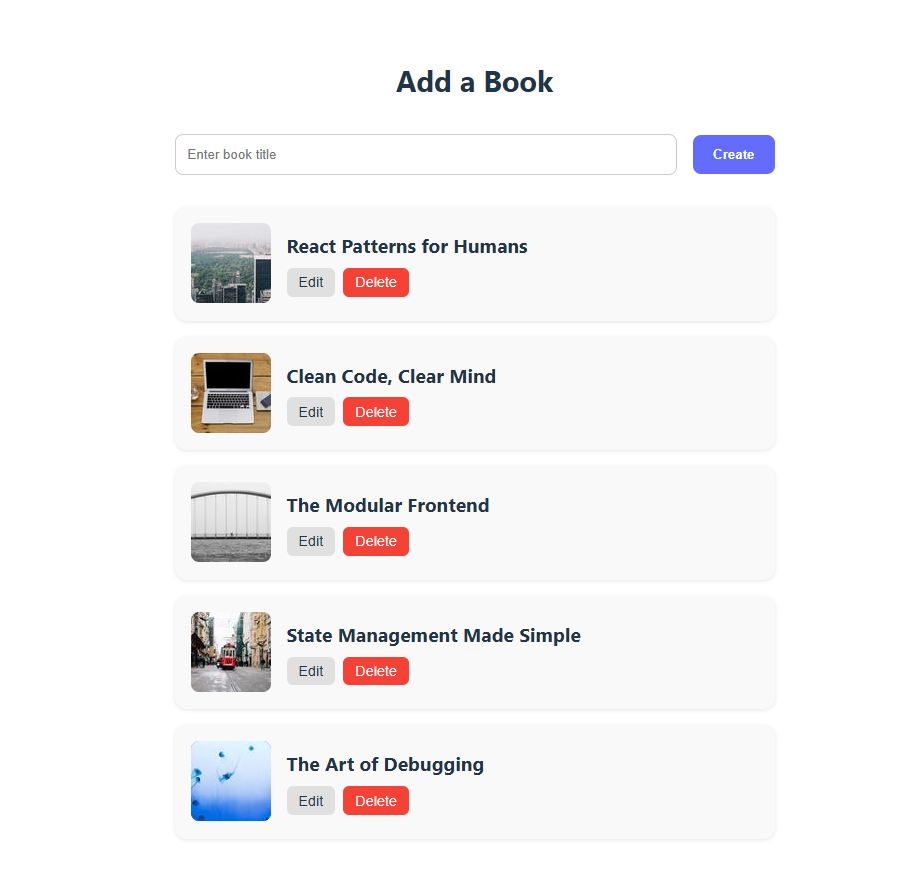

# Book Shelf

This project is part of my **React Practice Series**, a personal collection of frontend exercises focused on architectural clarity, emotionally intelligent state management, and accessible UI design.



---

## Purpose

To practice:

- Global state management using `Context` and `useReducer`
- Modular CRUD operations with `Axios` and `json-server`
- Editorial error handling and emotionally clear loading states
- Accessible form markup with ARIA attributes and semantic HTML
- Scalable component structure with teachable naming conventions
- Pure CSS layout with responsive behavior and visual clarity

---

## Features

- Add, edit, and delete books using a local mock API
- Global state managed via `Context` and `useReducer`
- Error and loading feedback with editorial styling
- Accessible forms with labeled inputs and keyboard-friendly buttons
- Modular components for each UI responsibility (`BookCreate`, `BookList`, `BookCard`, `BookEdit`)
- Responsive layout for mobile and desktop
- No external UI libraries, focusing on clean CSS and semantic markup

---

## Technologies Used

- **React** – Component-based UI development
- **Vite** – Fast build tool and dev server
- **Axios** – HTTP client for async operations
- **json-server** – Local REST API for mock data
- **CSS** – Custom styling with semantic HTML
- **ESLint** – Code linting and consistency

---

## API Reference

This project uses `json-server` to simulate a RESTful backend.

### Endpoints

- `GET /books` – Fetch all books
- `POST /books` – Create a new book
- `PUT /books/:id` – Update a book
- `DELETE /books/:id` – Delete a book

The server will be available at [http://localhost:3001](http://localhost:3001).

---

## Getting Started

### Installation & Setup

1. Clone the repository:

   ```bash
   git clone https://github.com/maitepv87/book-shelf.git
   cd book-shelf
   ```

   2. Install dependencies:

   ```bash
   npm install
   ```

2. Start the mock API server:

```bash
   npm run server
```

4.  Start the development server:

```bash
npm run dev
```

Then open http://localhost:3000 in your browser.
